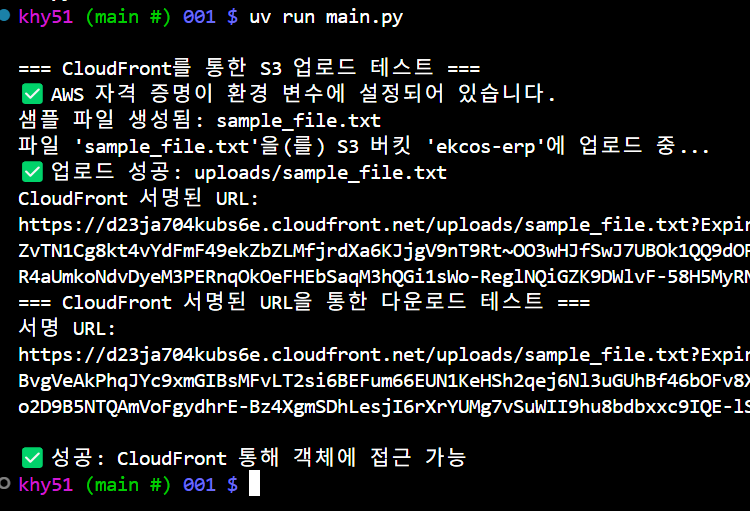

# aws s3(with. cloudfront) 업로드 다운로드 테스트


### Tasks of list  
- [1. RSA 키 생성](#create-rsa-key)
- [2. CloudFront에 키 등록](#register-key-in-cloudfront)
- s3 버킷 생성
- cloudfront 생성
- IAM 생성
- [.env파일 설정](#setting-env)
- [테스트 실행](#run-test)

<h3 id="create-rsa-key">1. RSA 키 생성</h3>

```
openssl genrsa -out private_key.pem 2048
openssl rsa -pubout -in private_key.pem -out public_key.pem
```

<h3 id="register-key-in-cloudfront">2. CloudFront에 키 등록</h3>

1. **CloudFront → Key Management** 메뉴
2. **Public key 추가**
    - 이름: `cf-key-1`
    - PEM 형식 `public_key.pem` 복사해서 붙여넣기
3. **Key Group 생성**
    - 위의 public key를 포함
4. CloudFront 배포에 적용:
    - *Behaviors* → *Cache policy* or *Restrictions* 에서 **Signed URL 또는 Signed Cookies 사용** 설정

---


<h3 id="setting-env">`.env` 설정</h3>

AWS_ACCESS_KEY_ID <- IAM 생성후 CLI용 액세스키 발급  
AWS_SECRET_ACCESS_KEY <- IAM 생성후 CLI용 액세스키 발급  
AWS_S3_REGION_NAME <- 생성한 버킷 리전  

CLOUDFRONT_DOMAIN <- 생성한 클라우드프론트 도메인  
CLOUDFRONT_KEY_PAIR_ID <- 클라우드프론트에서 생성한 퍼블릭키 ID  
S3_BUCKET_NAME <- s3 버킷 이름  

<h3 id='run-test'>테스트 실행</h3>  

- uv sync  
    ```bash
    uv sync
    ```

- uv run
    ```bash
    uv run main.py
    ```

